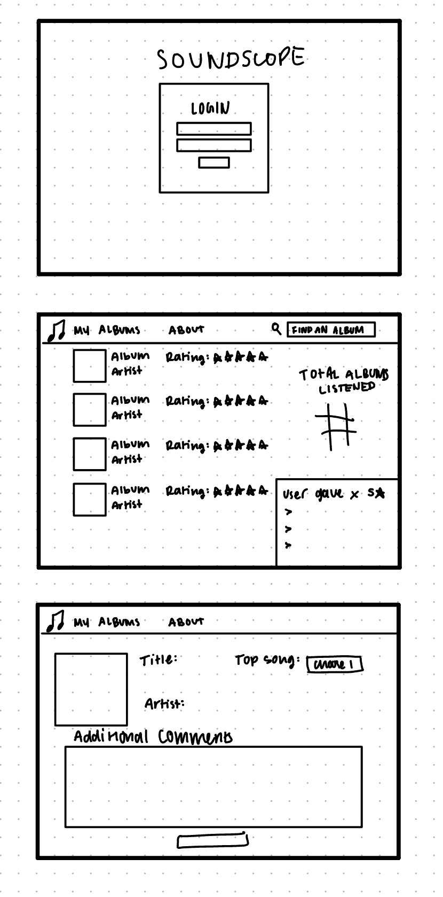

# SoundScope
[My Notes](notes.md)

SoundScope is an app that allows users to select and rate albums, as well as view recent reviews from other users.

## 🚀 Specification Deliverable

> [!NOTE]
>  Fill in this sections as the submission artifact for this deliverable. You can refer to this [example](https://github.com/webprogramming260/startup-example/blob/main/README.md) for inspiration.

For this deliverable I did the following. I checked the box `[x]` and added a description for things I completed.

- [x] Proper use of Markdown
- [x] A concise and compelling elevator pitch
- [x] Description of key features
- [x] Description of how you will use each technology
- [x] One or more rough sketches of your application. Images must be embedded in this file using Markdown image references.

### Elevator pitch

My music library has grown to be a mess over the years as I have discovered more and more music. I will find music in my library that I'm not sure I ever actually listened to. With SoundScope, users can rate and review albums they have listened to, as well as see what others are enjoying.

### Design

Sketch of the basic design.

### Key features

- Secure login
- Ability to search for albums
- Ability to give albums a rating
- Ability to view recent ratings from other users
- Ability to view your reviews. 

### Technologies

I am going to use the required technologies in the following ways.

- **HTML** - Will use HTML for structure of the web app, there will be 3 HTML pages. One for login, one for recent reviews, one for adding a review. 
- **CSS** - Will be used for styling HTML elements, adding a cohesive color scheme, and vibe to the whole app.
- **React** - Used for buttons, adding functionality 
- **Service** - Will use Spotify's API (external service) to search for albums, and retrieve information about them, including their artist, and track titles. 
- **DB/Login** - Stores users and reviews in a database, and authenticates users when they log in. 
- **WebSocket** - Users are able to see reviews from other users. 

## 🚀 AWS deliverable

For this deliverable I did the following. I checked the box `[x]` and added a description for things I completed.

- [x] **Server deployed and accessible with custom domain name** - [http://soundscope.click](http://soundscope.click).

## 🚀 HTML deliverable

For this deliverable I did the following. I checked the box `[x]` and added a description for things I completed.

- [x] **HTML pages** - I made 4 html pages -- a login page, a page for recent ratings, a page for the users ratings, a page for rating an album, and an about page. The user ratings and recent ratings page follow essentially the same format. 
- [x] **Proper HTML element usage** - I used elements in my header, and body to organize my structure. I used input elements, and created some div elements to help when it comes to styling and functionality. 
- [x] **Links** - The navigation has links to other html pages. 
- [x] **Text** - About page includes text about the idea, and each element contains text. 
- [x] **3rd party API placeholder** - The artist, album title, and album cover will be found using the Spotify API, and the search bar will search the Spotify catalog. For now I just put placeholder images and values.  
- [x] **Images** - I inserted the placeholder image, since the real images will come from the 3rd party API.
- [x] **Login placeholder** - I added fields for an email and password, as well as buttons to log in or create an account. 
- [x] **DB data placeholder** - Login/user info will be stored in a database allowing authenication.
- [x] **WebSocket placeholder** - This is the recent reviews page, where users can see in real time when another user submits a review. 

## 🚀 CSS deliverable

For this deliverable I did the following. I checked the box `[x]` and added a description for things I completed.

- [X] **Header, footer, and main content body** - I added a navigation bar for the header, which, along with the footer, is consistent across each page. Each page also has a main content body. 
- [x] **Navigation elements** - I added a navigation bar which turns into a toggle button on smaller screens. 
- [x] **Responsive to window resizing** - I added media queries to make my pages responsive. When the window reaches a certain width getting smaller, the footer is not displayed and the navigation is under a toggle button. 
- [ ] **Application elements** - I did not complete this part of the deliverable.
- [x] **Application text content** - I styled the parts of my application that include text, including placeholder text for data from third party. I also included an external font. 
- [x] **Application images** - Because the images will be retrieved from a third party, I still only have the placeholders in place. They are placed how I want them, so they will be rendered correctly.

## 🚀 React part 1: Routing deliverable

For this deliverable I did the following. I checked the box `[x]` and added a description for things I completed.

- [ ] **Bundled using Vite** - I did not complete this part of the deliverable.
- [ ] **Components** - I did not complete this part of the deliverable.
- [ ] **Router** - Routing between login and voting components.

## 🚀 React part 2: Reactivity

For this deliverable I did the following. I checked the box `[x]` and added a description for things I completed.

- [ ] **All functionality implemented or mocked out** - I did not complete this part of the deliverable.
- [ ] **Hooks** - I did not complete this part of the deliverable.

## 🚀 Service deliverable

For this deliverable I did the following. I checked the box `[x]` and added a description for things I completed.

- [ ] **Node.js/Express HTTP service** - I did not complete this part of the deliverable.
- [ ] **Static middleware for frontend** - I did not complete this part of the deliverable.
- [ ] **Calls to third party endpoints** - I did not complete this part of the deliverable.
- [ ] **Backend service endpoints** - I did not complete this part of the deliverable.
- [ ] **Frontend calls service endpoints** - I did not complete this part of the deliverable.

## 🚀 DB/Login deliverable

For this deliverable I did the following. I checked the box `[x]` and added a description for things I completed.

- [ ] **User registration** - I did not complete this part of the deliverable.
- [ ] **User login and logout** - I did not complete this part of the deliverable.
- [ ] **Stores data in MongoDB** - I did not complete this part of the deliverable.
- [ ] **Stores credentials in MongoDB** - I did not complete this part of the deliverable.
- [ ] **Restricts functionality based on authentication** - I did not complete this part of the deliverable.

## 🚀 WebSocket deliverable

For this deliverable I did the following. I checked the box `[x]` and added a description for things I completed.

- [ ] **Backend listens for WebSocket connection** - I did not complete this part of the deliverable.
- [ ] **Frontend makes WebSocket connection** - I did not complete this part of the deliverable.
- [ ] **Data sent over WebSocket connection** - I did not complete this part of the deliverable.
- [ ] **WebSocket data displayed** - I did not complete this part of the deliverable.
- [ ] **Application is fully functional** - I did not complete this part of the deliverable.
